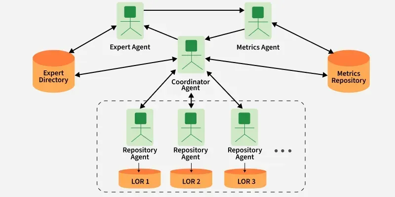
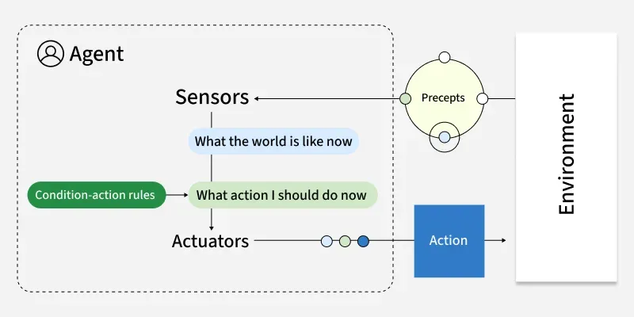
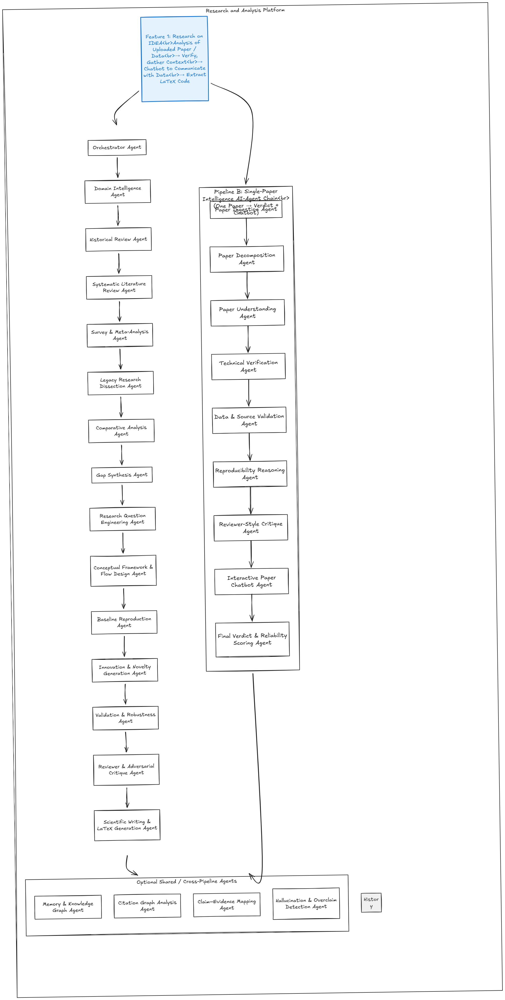
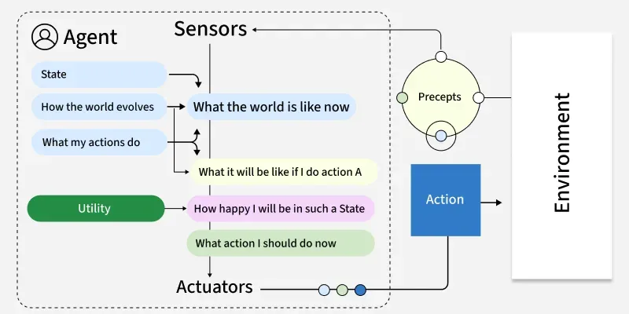
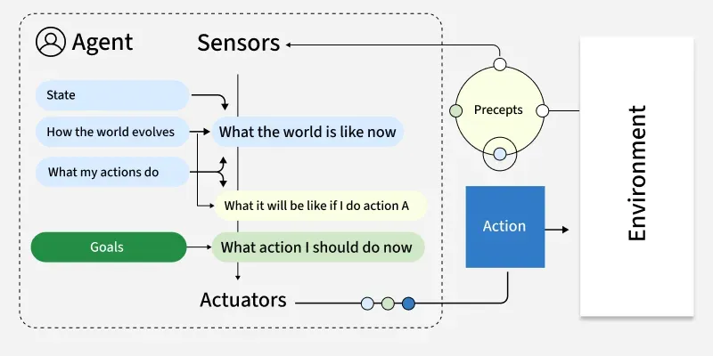
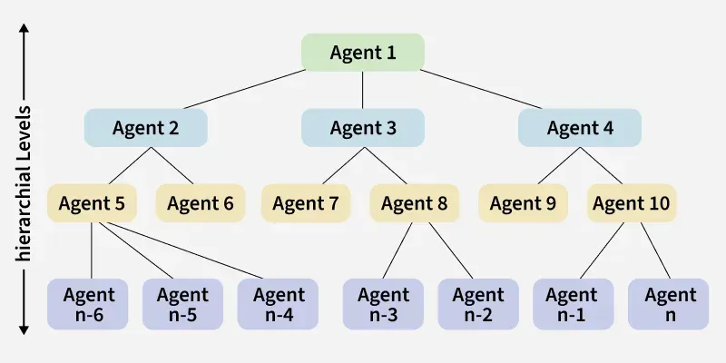

# Multi-Agent LLM Research Automation Platform

<div align="center">

</div>

## About the Project

The **Multi-Agent LLM Research Automation Platform** is an intelligent system that revolutionizes academic research by leveraging a sophisticated multi-agent architecture powered by LangGraph and Large Language Models. This platform can analyze individual research papers, perform comprehensive literature reviews, identify research gaps, and even generate novel research directions.

Built with modern AI technologies, the platform combines automated information retrieval, structured systematic review protocols, and multi-agent collaboration to provide researchers with powerful tools for accelerating their work. Whether you're conducting single-paper analysis or exploring entire research domains, our system delivers reliable, reproducible results with full transparency.


## Agent Overview

| Category | Agent Name | Purpose |
|----------|------------|---------|
| **Orchestration** | Orchestrator Agent | Routes tasks and manages workflow |
| **Discovery** | Domain Intelligence Agent | Maps research landscapes |
| | Historical Review Agent | Chronological analysis via ArXiv |
| **Literature Review** | Systematic Literature Review Agent | PRISMA-compliant reviews |
| | Survey Meta-Analysis Agent | Statistical synthesis |
| **Synthesis** | Gap Synthesis Agent | Identifies research opportunities |
| | Research Question Engineering Agent | Generates research questions |
| | Conceptual Framework Agent | Builds theoretical models |
| **Innovation** | Innovation & Novelty Agent | Creates novel research ideas |
| | Baseline Reproduction Agent | Reproduces existing methods |
| | Validation & Robustness Agent | Tests research validity |
| **Paper Analysis** | Paper Decomposition Agent | Structural document parsing |
| | Paper Understanding Agent | Content summarization |
| **Verification** | Technical Verification Agent | Claims validation |
| | Data Source Validation Agent | Source credibility checking |
| | Reproducibility Reasoning Agent | Reproducibility assessment |
| **Interaction** | Interactive Paper Chatbot Agent | Conversational paper analysis |
| | Reviewer Style Critique Agent | Academic peer review |
| **Shared Services** | Memory & Knowledge Graph Agent | Information persistence |
| | Citation Graph Analysis Agent | Citation network analysis |
| | Scientific Writing Agent | Academic paper composition |
| | LaTeX Generation Agent | Professional typesetting |
| | Adversarial Critique Agent | Bias and error detection |
| | Hallucination Detection Agent | AI output validation |

## API Showcase

### AI Engine API (Python/FastAPI)
```bash
# Health Check
GET /health

# Research Analysis
POST /research
Content-Type: application/json

{
  "task": "Analyze transformer architecture evolution",
  "paper_url": "https://arxiv.org/pdf/1706.03762.pdf",
  "depth": "deep"
}

# Individual Agent Calls
POST /agent/{agent_slug}
```

### Backend API (Node.js/Express)
```bash
# Authentication
POST /auth/login
POST /auth/register

# Research Sessions
POST /research
GET /research/{id}
GET /research/{id}/status

# Chat Interface
POST /chat/message

# Real-time Events
GET /events/stream
```


## Architecture Diagrams

### Agent Types Overview
<div align="center">

</div>

### Research Workflow
<div align="center">

</div>

### Learning Agent Architecture
<div align="center">

</div>

### Goal-Based Agent System
<div align="center">

</div>

### Utility-Based Decision Making
<div align="center">

</div>

### Hierarchical Agent Structure
<div align="center">

</div>

### Model-Based Reflex Agent
<div align="center">

</div>


## Technology Stack

- **AI Engine**: Python, FastAPI, LangGraph, LangChain
- **Backend**: Node.js, Express.js, PostgreSQL
- **Frontend**: React, TypeScript, Vite
- **LLMs**: Ollama, Google Gemini, Groq
- **Infrastructure**: Docker, Redis, Nginx

---

<p align="center">
  <strong>Accelerating Research Through Intelligent Automation</strong>
</p>
