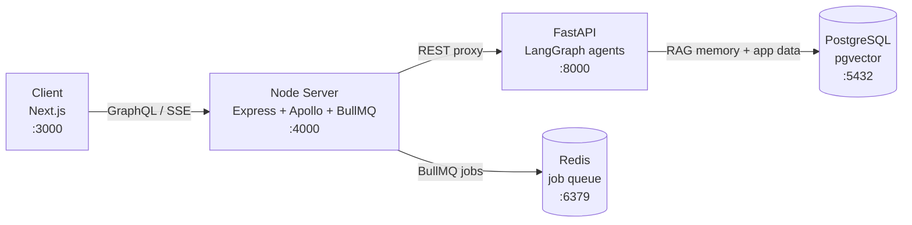
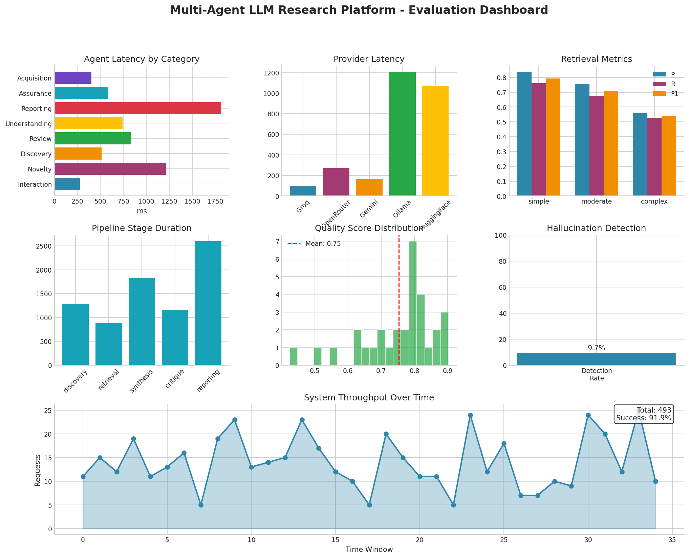

# Multiagent Research Automation Platform

**Multiagent LangGraph-Orchestrated LLM Research Automation Platform**

One query in — a sourced, structured, exportable research report out. A pipeline of LangGraph agents (Planner → Searcher → Crawler → Reasoner → Reviewer → Writer) does the tab-hopping for you.

[Documentation](https://omchoksi108.github.io/Multiagent-LangGraph-Orchestrated-LLM-Research-Automation-Platform/)

---

## Architecture


```mermaid
flowchart LR
    client["Client<br/>Next.js<br/>:3000"]
    node["Node Server<br/>Express + Apollo + BullMQ<br/>:4000"]
    fastapi["FastAPI<br/>LangGraph agents<br/>:8000"]
    redis[("Redis<br/>job queue<br/>:6379")]
    postgres[("PostgreSQL<br/>pgvector<br/>:5432")]

    client -->|"GraphQL / SSE"| node
    node -->|"REST proxy"| fastapi
    node -->|"BullMQ jobs"| redis
    fastapi -->|"RAG memory + app data"| postgres
```

| Service    | Tech                                             | Port | Role                                             |
| ---------- | ------------------------------------------------ | ---- | ------------------------------------------------ |
| `client`   | Next.js 16, React 19, Tailwind 4                 | 3000 | Landing, auth, dashboard, research chat UI       |
| `node`     | Express, Apollo GraphQL, BullMQ, Sequelize       | 4000 | Auth (JWT), job queue, SSE progress, API gateway |
| `fastapi`  | FastAPI, LangGraph, LangChain, Groq/OpenRouter   | 8000 | Multi-agent research engine, RAG, paper writer   |
| `postgres` | pgvector/pgvector:pg16                           | 5432 | Users, sessions, documents, vector embeddings    |
| `redis`    | redis:7-alpine                                   | 6379 | BullMQ queue backing store                       |

---

## Showcase



The evaluation dashboard tracks pipeline timing, provider latency, retrieval quality, throughput, and reliability across the multi-agent research flow.

---

## Quick Start (Docker)

### 1. Configure environment

```bash
cp .env.example .env
# then edit .env — at minimum set:
#   GROQ_API_KEY   (or OPENROUTER_API_KEY)
#   EXA_API_KEY    (or TAVILY_API_KEY / BRAVE_SEARCH_API_KEY)
#   JWT_SECRET     (any long random string)
```

All services load their configuration from this single root `.env` via `docker-compose.yml`. Container-to-container wiring (`POSTGRES_HOST=postgres`, `REDIS_HOST=redis`, `FASTAPI_URL=http://fastapi:8000`) is injected automatically by compose — you don't need to change those.

### 2. Nuke, rebuild, run, and tail logs — one command

```bash
docker compose down --rmi local --volumes --remove-orphans && docker network prune -f && docker compose up --build -d && docker compose logs -f
```

What it does, in order:

1. `docker compose down --rmi local --volumes --remove-orphans` — stops the stack, **deletes old images** built by this project, **deletes volumes** (Postgres + Redis data), and removes stray containers.
2. `docker network prune -f` — **deletes unused networks**.
3. `docker compose up --build -d` — **rebuilds all images** and starts everything in the background, in dependency order (postgres/redis → fastapi → node → client).
4. `docker compose logs -f` — **streams live logs** from all five services (Ctrl-C detaches without stopping anything).

>  `--volumes` wipes the database. Drop that flag for a rebuild that keeps your data:
> ```bash
> docker compose down --rmi local --remove-orphans && docker compose up --build -d && docker compose logs -f
> ```

### 3. Open the app

| URL                                  | What                          |
| ------------------------------------ | ----------------------------- |
| http://localhost:3000                | Client UI                     |
| http://localhost:4000/graphql        | GraphQL playground            |
| http://localhost:4000/api/health     | Node health                   |
| http://localhost:8000/docs           | FastAPI Swagger docs          |
| http://localhost:8000/api/health     | FastAPI health                |

### Health checks

Every service has a Docker healthcheck; `depends_on: condition: service_healthy` gates startup order so nothing boots before its dependencies are ready.

```bash
docker compose ps          # STATUS column shows (healthy) / (unhealthy)
curl -s localhost:4000/api/health
curl -s localhost:8000/api/health
```

### Everyday commands

```bash
docker compose up -d                 # start (no rebuild)
docker compose logs -f node          # tail one service
docker compose restart fastapi       # bounce one service
docker compose exec postgres psql -U kuchi_user -d kuchi_db   # DB shell
docker compose down                  # stop (keeps data)
```

---

## Local Development (without Docker)

You still need Postgres (with pgvector) and Redis running — easiest is to run just those two in Docker:

```bash
docker compose up -d postgres redis
```

**FastAPI** (Python 3.12+):

```bash
cd server/fastapi_server
source .venv/bin/activate            # or: python -m venv .venv && source .venv/bin/activate
pip install -r requirements.txt
uvicorn main:app --reload --port 8000
```

**Node server**:

```bash
cd server/ts_server
npm install
npm run dev                          # node --watch, port 4000
```

**Client**:

```bash
cd client
npm install
npm run dev                          # Next.js dev server, port 3000
```

---

## Environment Variables

See [.env.example](.env.example) for the full annotated list. The important ones:

| Variable                                  | Used by        | Purpose                                        |
| ----------------------------------------- | -------------- | ---------------------------------------------- |
| `GROQ_API_KEY` / `OPENROUTER_API_KEY`     | fastapi        | LLM provider (`DEFAULT_LLM_PROVIDER` selects)  |
| `EXA_API_KEY` / `TAVILY_API_KEY`          | fastapi        | Web search (`WEB_SEARCH_PROVIDER` selects)     |
| `POSTGRES_USER/PASSWORD/DB`               | all backends   | Database credentials                           |
| `JWT_SECRET`                              | node           | Auth token signing                             |
| `RESEND_API_KEY`, `EMAIL_FROM`            | node           | Verification emails                            |
| `NEXT_PUBLIC_GRAPHQL_URL`                 | client (build) | GraphQL endpoint baked into the browser bundle |
| `NEXT_PUBLIC_API_URL`                     | client (build) | SSE/REST base URL baked into the bundle        |
| `CLIENT_PORT` / `NODE_PORT` / `FASTAPI_PORT` | compose     | Published host ports                           |

> `NEXT_PUBLIC_*` values are compiled into the client at **build** time. If you change them, rebuild the client image: `docker compose build client`.

---

## Repository Layout

```
├── client/                  # Next.js frontend
│   ├── src/app/             # App-router pages (landing, settings, …)
│   ├── src/components/      # Dashboard, ResearchChat, AuthModal, …
│   └── Dockerfile
├── server/
│   ├── ts_server/           # Express + Apollo GraphQL + BullMQ
│   │   ├── src/             # index, graphql, db, queue, sse, email, logger
│   │   └── Dockerfile
│   └── fastapi_server/      # LangGraph research engine
│       ├── app/agents/      # planner, searcher, crawler, reasoner, reviewer, writer, …
│       ├── app/routers/     # research, rag, paper, images
│       ├── app/services/    # embeddings, rag
│       └── Dockerfile
├── scripts/
│   └── init-pgvector.sql    # CREATE EXTENSION vector (runs on first DB boot)
├── docker-compose.yml       # Full-stack orchestration
├── .env.example             # Annotated env template → copy to .env
└── docs/
```

## Agent Pipeline

`Planner` breaks the question into sub-queries → `Searcher` hits the web-search provider → `Crawler` fetches and extracts sources → `Chunker`/embeddings feed RAG → `Reasoner` synthesizes with citations → `Reviewer` critiques (revision loop depth: Fast=0, Balanced=1, Deep=2) → `Writer`/`PaperWriter` produce the final report, streamed to the UI over SSE.
