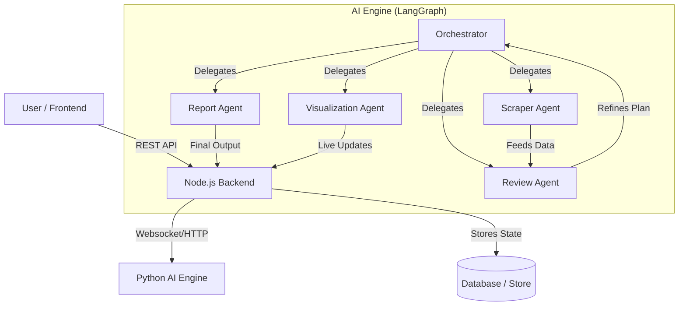
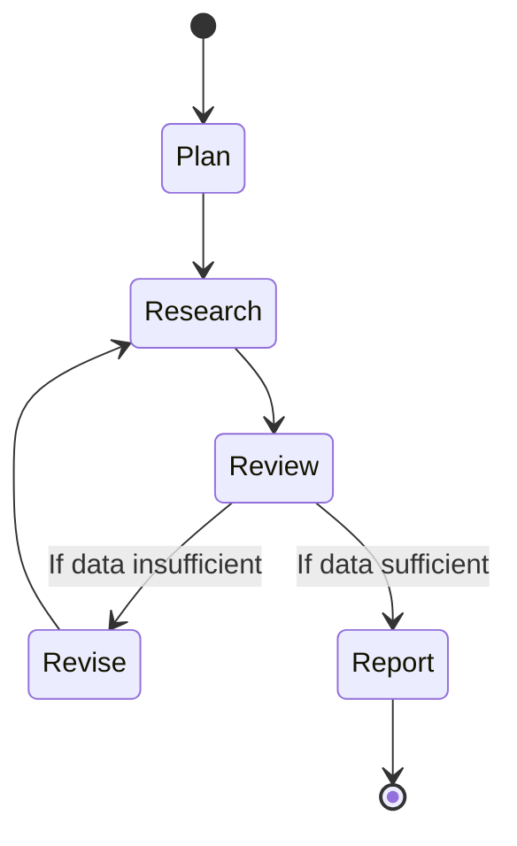

# System Architecture

The Deep Research Engine follows a modular, microservices-based architecture, orchestrating multiple AI agents to perform complex research tasks.

## High-Level Overview

## Component Breakdown

### 1. Frontend (React + TypeScript)
- **Framework**: React 18 with Vite.
- **State Management**: Zustand for global store (auth, research state).
- **UI Library**: Tailwind CSS with Shadcn/UI components.
- **Communication**: REST API for actions, Polling/Websocket (planned) for live updates.

### 2. Backend (Node.js + Express)
- **Role**: API Gateway and State Manager.
- **Auth**: JWT-based authentication.
- **Routes**:
    - `/auth`: User authentication.
    - `/research`: Job management.
    - `/events`: Event streaming from AI Engine.

### 3. AI Engine (Python + LangGraph)
- **Core**: Built on LangGraph for stateful, cyclic agent orchestration.
- **LLM**: Supports multiple providers (Gemini, Groq, OpenAI).
- **Agents**: specialized modules for distinct tasks.

## Orchestration Flow

The **Orchestrator Agent** is the brain of the operation. It maintains the global state and decides the next step based on the current context.

