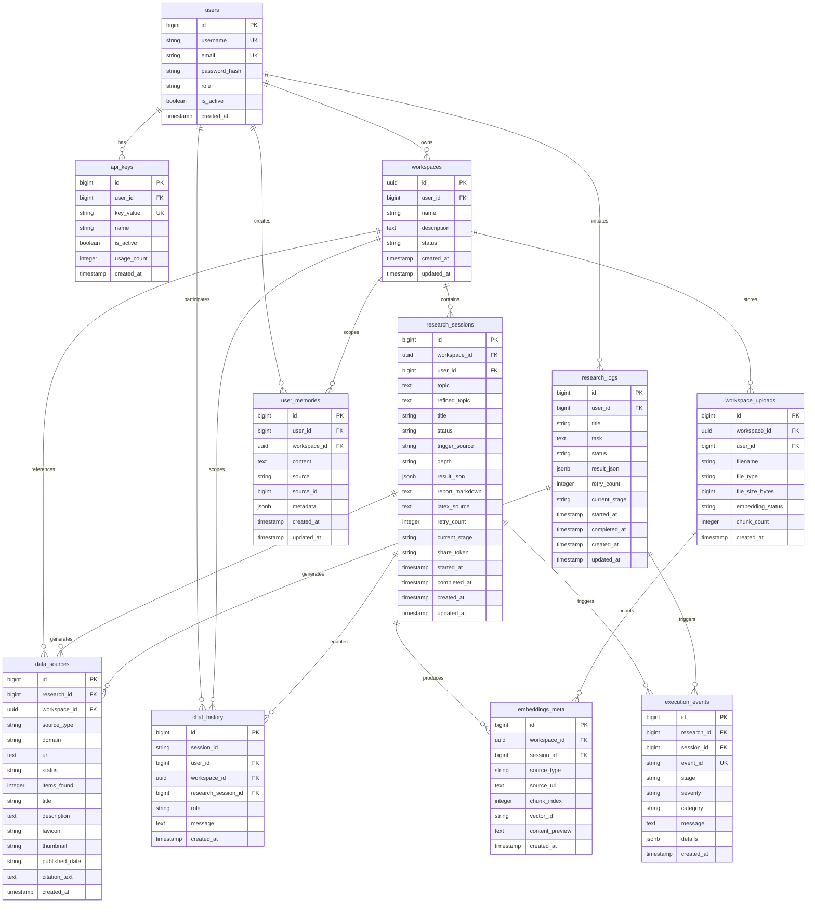

# Paperguide Backend Schema Diagram

## Entity Relationship Diagram (Mermaid)

## Key Relationships Explained

### Core User Flow
1. **User** creates **API Keys** for external access
2. **User** creates **Workspaces** (isolated containers)
3. **User** initiates **Research Sessions** within a workspace
4. **Research Sessions** generate **Data Sources**, **Execution Events**, and **Embeddings**
5. **Research Sessions** enable **Chat History** scoped to the workspace

### Workspace Isolation Pattern
- All research artifacts are scoped by `workspace_id` (UUID)
- `research_sessions` replaced `research_logs` for new workspace-aware flow
- Legacy `research_logs` still supported for backward compatibility
- Dual-source support: `data_sources` and `execution_events` can reference either table

### Data Flow
1. **Research Creation**: User → Workspace → Research Session → AI Engine
2. **Progress Tracking**: AI Engine → Execution Events → SSE Stream → Frontend
3. **RAG Pipeline**: Uploads → Embeddings → Chat Context
4. **Sharing**: Research Session → Share Token → Public Access

### Index Strategy
- **Performance**: User-scoped indexes on foreign keys
- **Search**: Full-text search on `user_memories.content` using GIN
- **Time-based**: Composite indexes on `(status, created_at)` for efficient queries
- **Uniqueness**: Natural keys and unique constraints on identifiers

### Migration Path
- **Migration 007**: Introduced workspace isolation with UUID PKs
- **Migration 008**: Enabled dual-source support (research_logs + research_sessions)
- **Backward Compatibility**: All new tables nullable for legacy flow

## Schema Design Principles

1. **Workspace Isolation**: UUID primary keys prevent ID collisions across environments
2. **Soft Deletes**: Workspaces archived rather than deleted for data recovery
3. **Cascade Cleanup**: Proper FK constraints maintain referential integrity
4. **Audit Trail**: `created_at`/`updated_at` on all mutable entities
5. **Flexible Metadata**: JSONB fields allow extensible data storage
6. **Performance Optimization**: Strategic indexes for common query patterns
7. **Security**: User-scoped data isolation with workspace boundaries

## Usage Notes

### For Frontend Developers
- Use `workspace_id` (UUID) for all workspace-scoped operations
- Check both `research_logs` and `research_sessions` for backward compatibility
- Handle `share_token` for public research sharing
- Use SSE events for real-time progress updates
- Respect soft deletes by checking `status = 'archived'`

### For Backend Developers
- Always validate `workspace_id` ownership in workspace-scoped routes
- Use transactions for multi-table operations
- Implement proper error handling with consistent JSON error format
- Use the `trigger_source = 'user'` filter to avoid reprocessing system jobs
- Support both legacy and new research session tables during transition period
