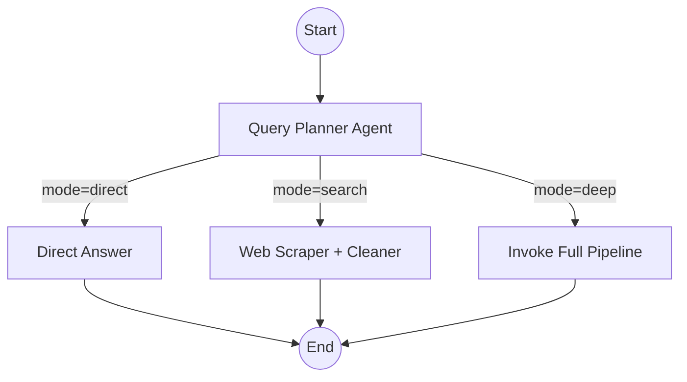
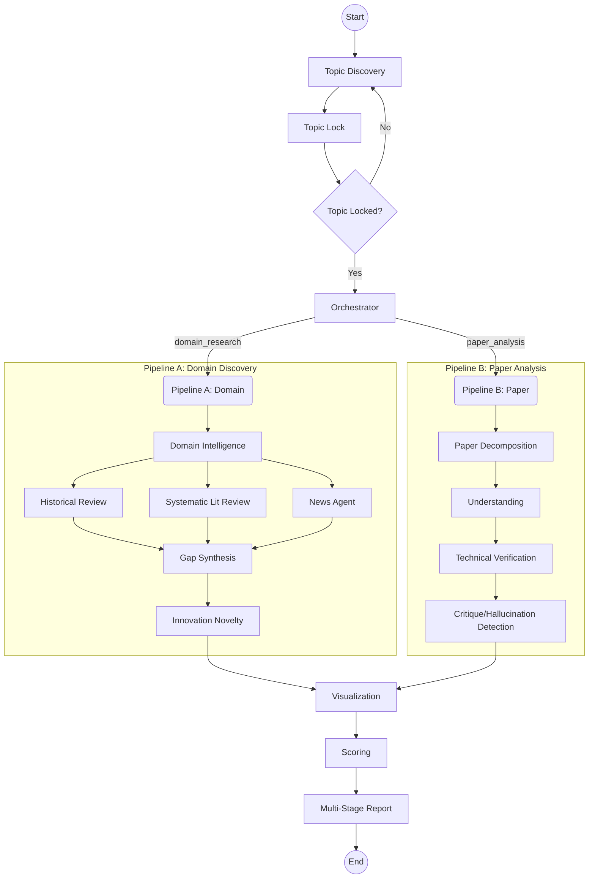

# Project Architecture: Agents & Control Flow

This report details the multi-agent system structure, including a census of all specialized AI agents and the LangGraph-based control flow orchestration.

## Agent Registry Analysis

There are **36 specialized AI agents** registered in the system (defined in [ai_engine/agents/registry.py](file:///d:/SEM%206/AIML317_PROJECT_III/project_sgp/ai_engine/agents/registry.py)). These agents are categorized by their role in the research pipeline.
a

### Agents List

| Phase / Category | Agent Keys |
| :--- | :--- |
| **Topic Discovery** | [topic_discovery](file:///d:/SEM%206/AIML317_PROJECT_III/project_sgp/ai_engine/graph/full_pipeline.py#136-143), [topic_lock](file:///d:/SEM%206/AIML317_PROJECT_III/project_sgp/ai_engine/graph/full_pipeline.py#144-151) |
| **Orchestration** | [orchestrator](file:///d:/SEM%206/AIML317_PROJECT_III/project_sgp/ai_engine/graph/full_pipeline.py#153-158), `query_planner` |
| **Data Acquisition** | `data_scraper`, [news](file:///d:/SEM%206/AIML317_PROJECT_III/project_sgp/ai_engine/graph/full_pipeline.py#163-164), `web_scraper` |
| **Domain Research** | `domain_intelligence`, `historical_review` |
| **Literature Review** | [slr](file:///d:/SEM%206/AIML317_PROJECT_III/project_sgp/ai_engine/graph/full_pipeline.py#162-163), `survey_meta_analysis`, `gap_synthesis`, `research_question`, `conceptual_framework` |
| **Novelty & Validation**| `innovation_novelty`, `baseline_reproduction`, `validation_robustness` |
| **Paper Analysis** | `paper_decomposition`, `paper_understanding`, `technical_verification`, `data_source_validation`, `reproducibility_reasoning` |
| **Critique & QA** | `adversarial_critique`, `hallucination_detection`, `reviewer_style_critique` |
| **Writing & Reporting**| `scientific_writing`, `latex_generation`, [multi_stage_report](file:///d:/SEM%206/AIML317_PROJECT_III/project_sgp/ai_engine/graph/full_pipeline.py#176-189), `ieee_paper` |
| **Interactive/Shared** | `interactive_chatbot`, `memory_graph`, `citation_analysis`, [visualization](file:///d:/SEM%206/AIML317_PROJECT_III/project_sgp/ai_engine/graph/full_pipeline.py#174-175), [scoring](file:///d:/SEM%206/AIML317_PROJECT_III/project_sgp/ai_engine/graph/full_pipeline.py#190-191), `section_reresearch`, `data_cleaner` |

---

## Control Flow Diagrams

 The system uses a two-tier graph orchestration.

### 1. Router Graph (Entry Point)
This graph classifies the user query and routes it to the appropriate execution mode.

### 2. Full Research Pipeline
This is the core multi-agent workflow for deep research.

### Key Architectural Patterns
- **Lazy Loading**: Agents are only instantiated when first used to save resources.
- **Parallel Execution**: Pipeline A runs historical, SLR, and News research in parallel before converging at Gap Synthesis.
- **State Management**: Uses LangGraph's `Annotated[Dict, merge_dicts]` to handle parallel finding updates without overwriting data.
- **Document Locking**: LaTeX writing and report generation use a global lock to prevent race conditions during parallel node execution.
